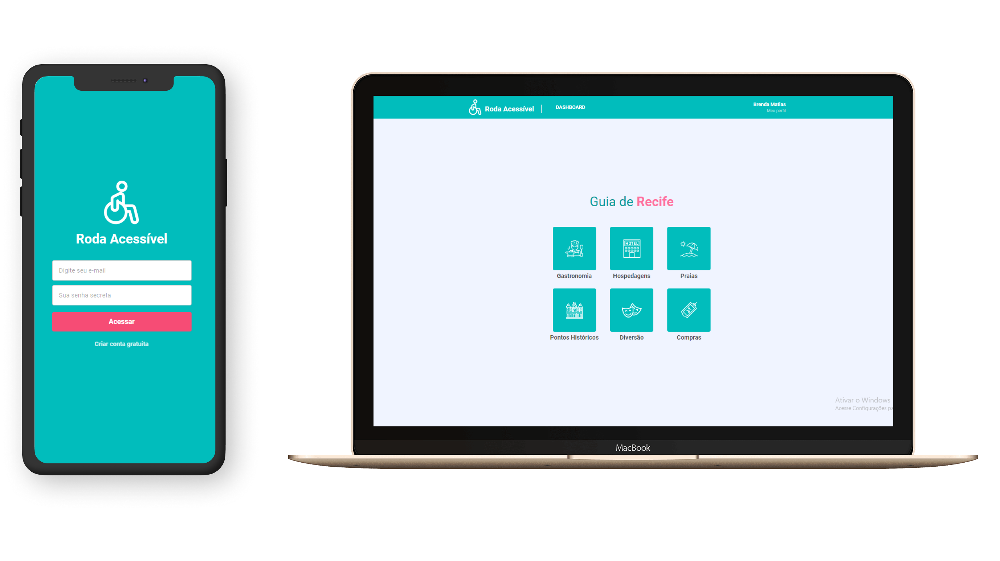

<h1 align="center">
    Roda Acessível :wheelchair:
</h1>

<h4 align="center">
  ☕ Code and coffee
</h4>

  <a href="#rocket-tecnologias">Tecnologias</a>&nbsp;&nbsp;&nbsp;|&nbsp;&nbsp;&nbsp;
  <a href="#-projeto">Projeto</a>&nbsp;&nbsp;&nbsp;|&nbsp;&nbsp;&nbsp;
  <a href="#-iniciando-aplicação">Iniciando aplicação</a>&nbsp;&nbsp;&nbsp;|&nbsp;&nbsp;&nbsp;
  <a href="#-web">Web</a>&nbsp;&nbsp;&nbsp;|&nbsp;&nbsp;&nbsp;
  <a href="#-mobile">Mobile</a>

 

  

## :rocket: Tecnologias

Esse projeto foi desenvolvido com as seguintes tecnologias:

- [Node.js](https://nodejs.org/en/)
- [Docker](https://docs.docker.com/)
- [Postgres](https://www.postgresql.org/)

## 💻 Projeto

O Roda Acessível é uma aplicação que visa disponibilizar informações sobre locais acessíveis na cidade do Recife a deficientes físicos, em especial, aos cadeirantes.

## 🔖 Iniciando aplicação

- Clone este repositório usando `git clone git@github.com:brendamatias/roda-acessivel-server.git`;
- Mova-se para diretório da aplicação: `roda-acessivel-server`;
- Execute `yarn install` ou `npm install` para instalar as dependências;
- Crie seu container com `docker run --name database -e POSTGRES_PASSWORD=docker -p 5432:5432 -d postgres`;
- Suba o container: `docker start database`;
- Crie um arquivo .env através do `.env.example` e configure com seus respectivos dados;
- Execute as migrations da aplicação: `yarn migrate` ou `npm migrate`;
- Inicie a aplicação com `yarn dev` ou `npm dev`;

## 💻 Web

- Aplicação web disponível em: <a href="https://github.com/brendamatias/roda-acessivel-web">Web</a>

---

## :iphone: Mobile

- Aplicação mobile disponível em: <a href="https://github.com/brendamatias/roda-acessivel-app">Mobile</a>

---

### <a href="https://www.linkedin.com/in/brenda-matias/">LinkedIn</a>
